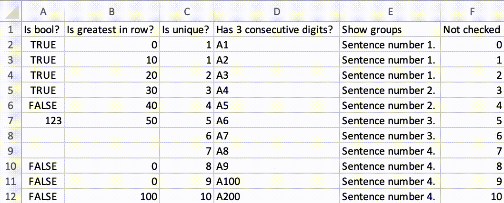

# checkmyxl
Automate validation of your data in Microsoft Excel sheet.  
Built on top of [xlwings]([https://www.xlwings.org).


## Installation
### With Conda package manager
See [Conda documentation](https://docs.conda.io) for more details.
```
# Clone this repository
git clone https://github.com/mateuszrezler/checkmyxl.git

# Go to `checkmyxl` directory
cd chechmyxl

# Create `checkmyxl` environment with dependencies
# macOS
conda create --channel conda-forge --name checkmyxl --yes \
    appscript pandas psutil rdkit xlwings
# Windows
conda create --channel conda-forge --name checkmyxl --yes \
    comtypes pandas pywin32 rdkit xlwings

# Activate new environment
conda activate checkmyxl

# Install xlwings addin
xlwings addin install

# Create empty project
xlwings quickstart checkmyxl

# Move `checkmyxl.xlsm` file to main directory
# macOS
mv checkmyxl/checkmyxl.xlsm checkmyxl.xlsm
# Windows
move checkmyxl\checkmyxl.xlsm checkmyxl.xlsm

# Remove residues
# macOS
rm -r checkmyxl
# Windows
deltree checkmyxl
```

## Test run
```
# Add sample data from `sample.csv` file to `checkmyxl.xlsm` file
python checkmyxl.py make_sample

# Start `main` function from `checkmyxl.py` file
python checkmyxl.py
# or select from Excel's menu: xlwings > Run main
```

